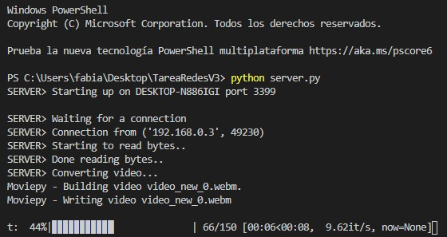

# <div align="center">Transfer Video Websockets :octocat:</div>
### <div align="center">TCP/IP Program using websockets for transfer video in real time. :fire:</div>

**Requirements:**
```
pip install moviepy
```

**Run server:**
```
python server.py
```

**Run client:**
```
python client.py
```
### Program demo:

<div class="row" align="center">
  
  
</div>
